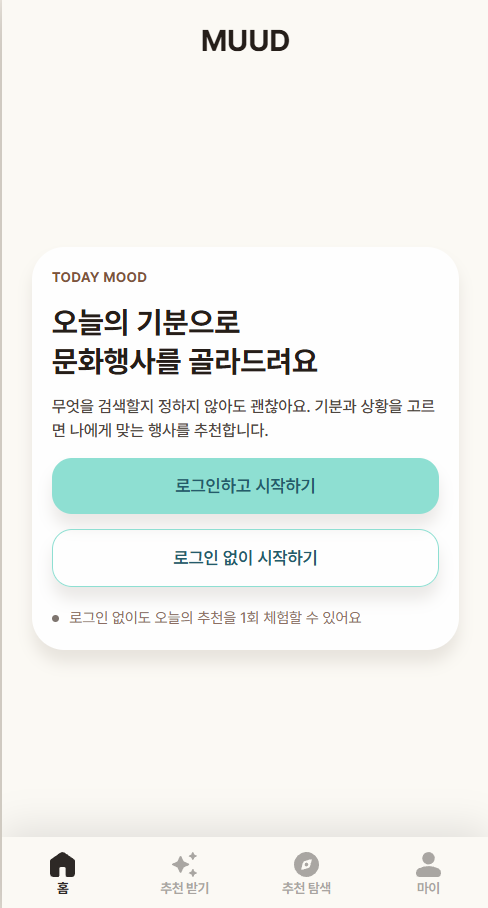
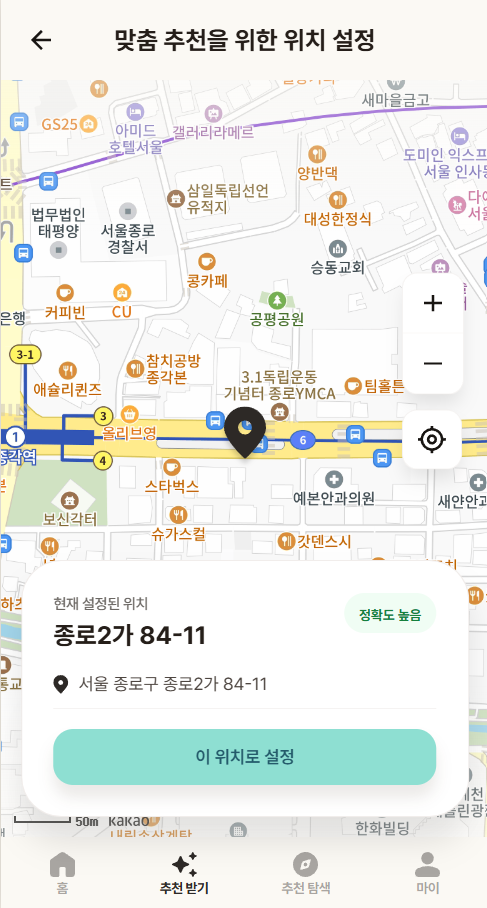
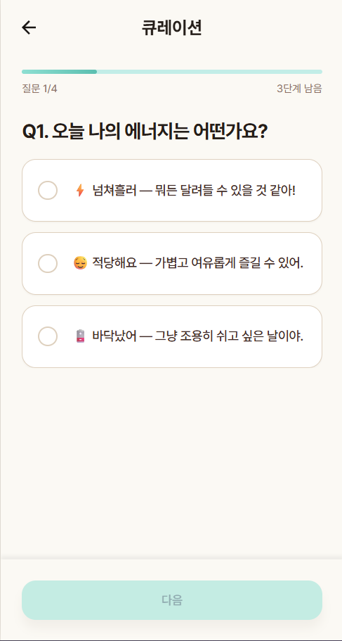
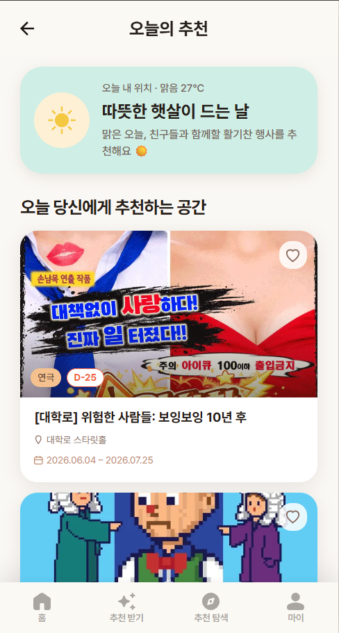
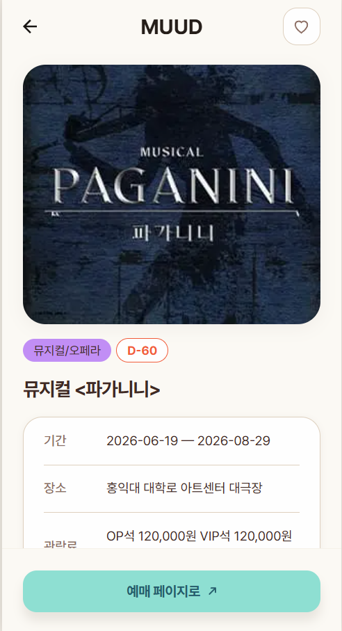
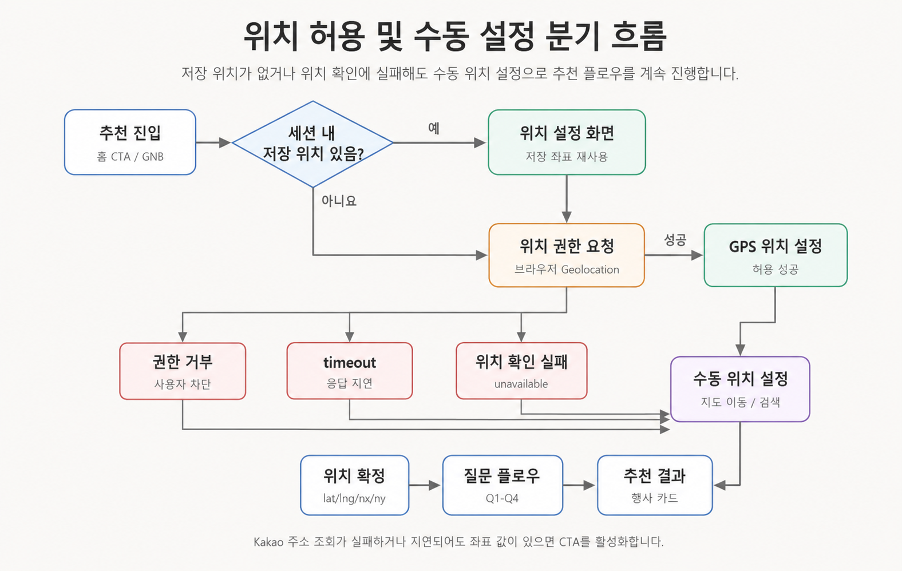

# MUUD

질문 기반으로 사용자의 현재 감정과 상황에 맞는 문화예술 경험을 추천하는 웹 애플리케이션입니다.

MUUD는 사용자가 복잡한 검색 조건을 직접 입력하지 않아도, 짧은 질문에 답하는 과정에서 현재 위치, 날씨, 대기질, 취향 정보를 함께 반영해 가까운 문화예술 행사를 발견할 수 있도록 돕는 것을 목표로 합니다.

> Production: https://muud-one.vercel.app/

## 목차

* [Status](#status)
* [Service](#service)
* [주요 기능](#주요-기능)
* [주요 화면](#주요-화면)
* [주요 페이지](#주요-페이지)
* [기술 스택](#기술-스택)
* [Getting Started](#getting-started)
* [Environment Variables](#environment-variables)
* [Scripts](#scripts)
* [프로젝트 구조](#프로젝트-구조)
* [API 및 데이터 기준](#api-및-데이터-기준)
* [위치 및 추천 플로우](#위치-및-추천-플로우)
* [협업 규칙](#협업-규칙)
* [개발 원칙](#개발-원칙)
* [문서](#문서)
* [이미지 자료 TODO](#이미지-자료-todo)

## Status

MUUD는 현재 MVP 개발 및 배포 단계에 있습니다.

주요 기능은 질문 기반 추천, 위치 설정, 주변 문화생활 탐색, 관심 행사 저장, 마이페이지를 중심으로 구성되어 있습니다.

## Service

| 항목           | 내용                           |
| ------------ | ---------------------------- |
| Service Name | MUUD / Good Vibe             |
| Repository   | `good-vibe-team/muud`        |
| App          | `apps/web`                   |
| Production   | https://muud-one.vercel.app/ |
| Organization | Good Vibe Team               |

> 이미지 삽입 영역
> 서비스 대표 화면 또는 홈 화면 스크린샷을 넣습니다.
> 권장 경로: `docs/images/readme/service-main.png`

```md

```

## 주요 기능

### 질문 기반 문화예술 추천

* 사용자의 현재 기분과 상황을 질문으로 수집
* Q1~Q4 답변을 기반으로 추천 실행
* 위치, 날씨, 미세먼지 정보를 함께 반영
* 추천 결과 카드 제공
* 추천 결과 상세 진입 지원
* 비회원은 추천 완료 이력을 기준으로 1회 제한

### 위치 설정

* 브라우저 Geolocation API 기반 현재 위치 확인
* Kakao Maps SDK 기반 지도 표시
* 지도 이동을 통한 수동 위치 설정
* 위치 권한 거부, 브라우저 미지원, 보안 컨텍스트 오류, timeout 구분
* 위치 실패 시에도 수동 위치 설정으로 추천 플로우 계속 진행
* 추천과 주변 탐색에서 최근 위치 저장소 재사용

### 주변 문화생활 탐색

* 현재 위치 또는 저장된 위치 기준 주변 행사 조회
* 지도와 행사 카드 목록 연동
* 지도 중심 변경에 따른 주변 행사 재조회
* 행사 마커 클릭 시 해당 행사 중심으로 목록 필터링
* 결과가 없을 때 빈 상태 제공

### 행사 상세

* 행사명, 장소, 기간, 카테고리, 이미지 확인
* D-Day / D-DAY / 종료 상태 표시
* 외부 예매 또는 상세 페이지 이동
* 관심 행사 저장 및 해제
* 외부 데이터의 HTML entity 포맷 정리

### 관심 행사

* 관심 행사 저장
* 관심 행사 해제
* 관심 행사 목록 조회
* 추천 결과, 행사 상세, 마이페이지 간 관심 상태 동기화

### 마이페이지

* 사용자 정보 조회
* 최근 추천 결과 확인
* 관심 행사 요약 확인
* 로그인 상태 기반 접근 제어

## 주요 화면

### 홈 / 추천 진입

> 이미지 삽입 영역
> 사용자가 MUUD의 목적과 추천 진입 CTA를 이해할 수 있는 화면을 넣습니다.
> 권장 경로: `docs/images/readme/home.png`

```md

```

### 위치 권한 요청 / 위치 설정

> 이미지 삽입 영역
> 위치 권한 허용, 실패 시 수동 위치 설정, 지도 중심 위치 설정 흐름을 보여주는 화면을 넣습니다.
> 권장 경로: `docs/images/readme/location.png`

```md

```

### 질문 플로우

> 이미지 삽입 영역
> Q1~Q4 질문 기반 추천 과정을 보여주는 화면을 넣습니다.
> 권장 경로: `docs/images/readme/questions.png`

```md

```

### 추천 결과

> 이미지 삽입 영역
> 추천 카드, 큐레이션 문구, 날씨/미세먼지 반영 결과를 보여주는 화면을 넣습니다.
> 권장 경로: `docs/images/readme/recommendations.png`

```md

```

### 주변 탐색

> 이미지 삽입 영역
> 지도, 마커, 행사 카드 목록이 함께 보이는 화면을 넣습니다.
> 권장 경로: `docs/images/readme/explore.png`

```md

```

### 행사 상세 / 관심 행사

> 이미지 삽입 영역
> 행사 상세 정보와 저장 상태를 보여주는 화면을 넣습니다.
> 권장 경로: `docs/images/readme/event-detail.png`

```md

```

## 주요 페이지

| 경로                     | 설명             |
| ---------------------- | -------------- |
| `/`                    | 홈 또는 서비스 진입 화면 |
| `/onboarding`          | 온보딩 화면         |
| `/login`               | 로그인            |
| `/signup`              | 회원가입           |
| `/location-permission` | 위치 권한 요청       |
| `/location`            | 위치 설정          |
| `/questions`           | 추천 질문 플로우      |
| `/recommendations`     | 추천 결과          |
| `/explore`             | 주변 문화생활 탐색     |
| `/favorites`           | 관심 행사 목록       |
| `/mypage`              | 마이페이지          |

## 기술 스택

| 구분              | 기술                                       |
| --------------- | ---------------------------------------- |
| Language        | TypeScript                               |
| Framework       | Next.js App Router                       |
| UI Library      | React                                    |
| Styling         | Tailwind CSS                             |
| Server State    | TanStack Query                           |
| Form            | react-hook-form                          |
| Validation      | zod                                      |
| Animation       | framer-motion                            |
| ORM             | Prisma                                   |
| Database        | Supabase PostgreSQL                      |
| Auth / Token    | jose 기반 자체 인증                            |
| External API    | 문화행사 API, 기상청 API, 에어코리아 API, Gemini API |
| Map             | Kakao Maps JavaScript SDK                |
| Package Manager | pnpm                                     |
| Lint / Format   | ESLint, Prettier                         |
| Deploy          | Vercel                                   |

## Getting Started

### Requirements

* Node.js 20+
* pnpm 9.0.0
* Supabase PostgreSQL 또는 호환 PostgreSQL DB
* Kakao Developers JavaScript 키
* 문화행사 / 날씨 / 미세먼지 / Gemini API 키

### 1. 저장소 클론

```bash
git clone https://github.com/good-vibe-team/muud.git
cd muud
```

### 2. 의존성 설치

```bash
pnpm install
```

### 3. 환경 변수 파일 생성

macOS / Linux:

```bash
cp apps/web/.env.example apps/web/.env.local
```

Windows PowerShell:

```powershell
Copy-Item apps/web/.env.example apps/web/.env.local
```

### 4. Prisma Client 생성

```bash
pnpm --filter web db:generate
```

### 5. 개발 서버 실행

```bash
pnpm dev
```

기본 실행 주소:

```txt
http://localhost:3000
```

## Environment Variables

환경 변수는 `apps/web/.env.example`을 기준으로 설정합니다.

### Database

| 변수명            | 필수 여부 | 설명                                                 |
| -------------- | ----- | -------------------------------------------------- |
| `DATABASE_URL` | 필수    | 앱 실행, Prisma Client 생성, build에 사용하는 DB 연결 URL      |
| `DIRECT_URL`   | 선택    | Prisma migration 및 DB schema 변경 담당자용 direct DB URL |

`DIRECT_URL`은 일반 개발자 필수값이 아닙니다. Migration 또는 schema 변경을 담당하는 경우에만 설정합니다.

### Auth / Token Secret

| 변수명                    | 필수 여부 | 설명                            |
| ---------------------- | ----- | ----------------------------- |
| `AUTH_SECRET`          | 필수    | 인증 및 토큰 처리에 사용하는 서버 전용 secret |
| `ACCESS_TOKEN_SECRET`  | 필수    | access token 서명 및 검증 secret   |
| `REFRESH_TOKEN_SECRET` | 필수    | refresh token 서명 및 검증 secret  |

### External API Keys

| 변수명               | 필수 여부 | 설명                  |
| ----------------- | ----- | ------------------- |
| `WEATHER_API_KEY` | 필수    | 기상청 API 호출 키        |
| `CULTURE_API_KEY` | 필수    | 문화행사 API 호출 키       |
| `DUST_API_KEY`    | 필수    | 에어코리아 미세먼지 API 호출 키 |
| `GEMINI_API_KEY`  | 필수    | Gemini API 호출 키     |

### Public Client Keys

| 변수명                         | 필수 여부 | 설명                                  |
| --------------------------- | ----- | ----------------------------------- |
| `NEXT_PUBLIC_KAKAO_MAP_KEY` | 필수    | 브라우저에서 사용하는 Kakao Maps JavaScript 키 |

`NEXT_PUBLIC_` prefix가 붙은 값은 클라이언트에 노출될 수 있습니다. 서버 전용 API key에는 `NEXT_PUBLIC_`을 붙이지 않습니다.

## Scripts

### Root

| 명령어                 | 설명                   |
| ------------------- | -------------------- |
| `pnpm dev`          | web 개발 서버 실행         |
| `pnpm build`        | web 프로덕션 빌드          |
| `pnpm lint`         | web ESLint 검사        |
| `pnpm typecheck`    | web TypeScript 타입 검사 |
| `pnpm format`       | web 코드 포맷팅           |
| `pnpm format:check` | web 포맷 검사            |

### Web

| 명령어                              | 설명                            |
| -------------------------------- | ----------------------------- |
| `pnpm --filter web dev`          | Next.js 개발 서버 실행              |
| `pnpm --filter web build`        | Prisma Client 생성 후 Next.js 빌드 |
| `pnpm --filter web start`        | 빌드 결과 실행                      |
| `pnpm --filter web lint`         | ESLint 검사                     |
| `pnpm --filter web typecheck`    | TypeScript 타입 검사              |
| `pnpm --filter web db:generate`  | Prisma Client 생성              |
| `pnpm --filter web db:push`      | Prisma schema를 DB에 반영         |
| `pnpm --filter web db:migrate`   | Prisma migration 생성 및 적용      |
| `pnpm --filter web db:status`    | Prisma migration 상태 확인        |
| `pnpm --filter web db:deploy`    | 배포 환경 migration 적용            |
| `pnpm --filter web db:resolve`   | migration 상태 수동 조정            |
| `pnpm --filter web db:studio`    | Prisma Studio 실행              |
| `pnpm --filter web format`       | Prettier 포맷팅                  |
| `pnpm --filter web format:check` | Prettier 포맷 검사                |

PR 생성 전 아래 명령 실행을 권장합니다.

```bash
pnpm lint
pnpm typecheck
pnpm build
```

## 프로젝트 구조

```txt
muud/
├─ apps/
│  └─ web/
│     ├─ prisma/
│     │  └─ schema.prisma
│     ├─ public/
│     └─ src/
│        ├─ app/
│        ├─ components/
│        │  ├─ common/
│        │  └─ layout/
│        ├─ features/
│        │  ├─ exploration/
│        │  ├─ location/
│        │  ├─ events/
│        │  ├─ recommendations/
│        │  └─ favorites/
│        ├─ lib/
│        └─ server/
│           └─ services/
├─ docs/
├─ package.json
├─ pnpm-workspace.yaml
└─ README.md
```

| 경로                               | 설명                                         |
| -------------------------------- | ------------------------------------------ |
| `apps/web/src/app`               | Next.js App Router 라우트, 페이지, Route Handler |
| `apps/web/src/components/common` | 버튼, 배지, 카드, 모달 등 공통 UI 컴포넌트                |
| `apps/web/src/components/layout` | Header, BottomNav 등 레이아웃 컴포넌트              |
| `apps/web/src/features`          | 도메인별 hook, UI, 클라이언트 로직                    |
| `apps/web/src/lib`               | 공통 유틸, query key, 외부 API 유틸                |
| `apps/web/src/server/services`   | 서버 서비스 로직                                  |
| `apps/web/prisma`                | Prisma schema 및 DB 관련 파일                   |
| `docs`                           | Git 전략, API 규칙 등 협업 문서                     |

## API 및 데이터 기준

MUUD는 Next.js App Router의 Route Handler를 사용해 내부 API를 구성합니다.

공통 API 규칙은 `docs/api-convention.md`를 따릅니다.

### API 응답 형식

성공 응답은 아래 형식을 기본으로 합니다.

```json
{
  "success": true,
  "data": {}
}
```

에러 응답은 아래 형식을 기본으로 합니다.

```json
{
  "success": false,
  "errorCode": "ERROR_CODE",
  "message": "에러 메시지"
}
```

목록 조회 결과가 0건인 경우에는 기본적으로 `200 OK`와 빈 배열을 반환합니다.

### 주요 API

| Method   | Endpoint                               | 설명                   |
| -------- | -------------------------------------- | -------------------- |
| `GET`    | `/api/users/me`                        | 내 정보 조회              |
| `POST`   | `/api/exploration-sessions`            | 위치 확정 후 탐색 세션 생성     |
| `GET`    | `/api/exploration-sessions/me`         | 추천 진입 전 비회원 사용 이력 확인 |
| `PATCH`  | `/api/exploration-sessions/:id/status` | 탐색 세션 상태 변경          |
| `POST`   | `/api/recommendations`                 | 추천 실행                |
| `GET`    | `/api/recommendations/:runId`          | 추천 결과 상세 조회          |
| `GET`    | `/api/recommendations/recent`          | 최근 추천 결과 조회          |
| `GET`    | `/api/events/:eventItemId`             | 행사 상세 조회             |
| `GET`    | `/api/events/nearby`                   | 주변 행사 조회             |
| `POST`   | `/api/favorites`                       | 관심 행사 저장             |
| `DELETE` | `/api/favorites/:eventItemId`          | 관심 행사 해제             |
| `GET`    | `/api/favorites`                       | 관심 행사 목록 조회          |
| `GET`    | `/api/favorites/count`                 | 관심 행사 개수 조회          |
| `POST`   | `/api/event-logs`                      | 이벤트 로그 저장            |

## 위치 및 추천 플로우

### 추천 진입 기준

추천받기 진입은 화면 이동만으로 처리하지 않고 서버 기준으로 가능 여부를 확인합니다.

1. 사용자가 홈 CTA 또는 하단 GNB에서 추천받기 진입
2. `/api/exploration-sessions/me` 호출
3. 로그인 사용자는 `userId` 기준으로 추천 흐름 판단
4. 비회원 사용자는 서버가 관리하는 `guestSessionKey`와 추천 완료 이력 기준으로 판단
5. 비회원이 이미 추천을 완료한 경우 제한 모달 표시
6. 추천 진입 가능 시 위치 플로우로 이동

### 위치 설정 기준

1. 세션 내 유효한 저장 위치가 있으면 위치 권한 요청 없이 위치 설정 페이지로 이동
2. 저장 위치가 없으면 브라우저 위치 권한 요청
3. 위치 허용 성공 시 GPS 좌표 기반 위치 설정
4. 위치 허용 실패 또는 timeout 시 수동 위치 설정으로 계속 진행
5. Kakao 주소 조회가 실패하거나 지연되어도 `lat`, `lng`, `nx`, `ny`가 있으면 CTA 활성 가능
6. 추천과 주변 탐색은 같은 최근 위치 저장 기준을 사용

### 최근 위치 저장 기준

| 항목       | 기준                            |
| -------- | ----------------------------- |
| 저장소      | `sessionStorage`              |
| key      | `muud:lastKnownLocation`      |
| TTL      | 1시간                           |
| 사용 범위    | 추천 플로우, 주변 탐색                 |
| 장기 저장 여부 | 사용자 기본 위치나 장기 위치 이력으로 취급하지 않음 |

> 이미지 삽입 영역
> 추천 진입 가능 여부 확인 → 위치 확인 → 질문 → 추천 실행 → 결과 화면 흐름을 넣습니다.
> 권장 경로: `docs/images/readme/recommendation-flow.png`

```md

```

> 이미지 삽입 영역
> 위치 허용 성공 / 실패 / timeout / 수동 위치 설정 분기 흐름을 넣습니다.
> 권장 경로: `docs/images/readme/location-fallback-flow.png`

```md

```

## 협업 규칙

자세한 Git / Issue / PR 규칙은 `docs/git-strategy.md`를 기준으로 따릅니다.

기본 흐름:

```txt
이슈 생성 → 브랜치 생성 → 개발 → 커밋 → PR → 리뷰 → Merge
```

### 브랜치 네이밍

```txt
type/#issue-number-short-description
```

예시:

```txt
feature/#30-common-components
fix/#193-location-resolving-state
docs/#199-sync-docs-before-readme
```

### 커밋 메시지

```txt
type: 작업 내용 (#이슈번호)
```

예시:

```txt
feat: 공통 컴포넌트 구현 (#30)
fix: 위치 허용 실패 시 수동 설정으로 이동 (#193)
docs: README 작성 전 문서 기준 정리 (#199)
```

### PR 규칙

PR 본문에는 관련 이슈를 연결합니다.

```txt
Closes #이슈번호
```

PR에는 아래 내용을 포함합니다.

* 관련 이슈
* 작업 내용
* 확인 방법
* 스크린샷 또는 Preview 확인 결과
* DB / API / 환경변수 변경 여부
* 보호 파일 변경 승인 기록

### 배포 확인

* PR 생성 후 Vercel Preview가 Ready 상태인지 확인합니다.
* UI 변경이 있는 PR은 Preview URL에서 최소 1회 수동 확인합니다.
* main merge 후 Production 배포 상태를 확인합니다.
* 배포 실패 시 후속 PR을 쌓기보다 실패 원인과 rollback 필요 여부를 먼저 판단합니다.

## 개발 원칙

* 하나의 PR은 하나의 목적만 가집니다.
* 기능 변경과 디자인 변경은 가능한 분리합니다.
* 공통 컴포넌트 수정 시 기존 사용처 영향 범위를 확인합니다.
* API 연동 작업은 loading, empty, error 상태를 함께 고려합니다.
* 인증 흐름 변경 시 로그인, 로그아웃, 새로고침, 뒤로가기 시나리오를 확인합니다.
* 위치 권한과 브라우저 storage를 다룰 때는 실패, timeout, 초기화 시점을 명확히 합니다.
* 외부 API 응답은 서버에서 정제한 뒤 내부 모델과 화면에 맞게 변환합니다.
* 보호 파일 변경 시 PR 본문에 승인자, 승인일, 변경 사유, 승인 범위를 기록합니다.
* AI가 생성한 코드는 작성자가 직접 읽고 설명할 수 있어야 하며, 이해하지 못한 코드는 merge하지 않습니다.

## 문서

| 문서                             | 설명                                   |
| ------------------------------ | ------------------------------------ |
| `docs/git-strategy.md`         | Git, Issue, Branch, Commit, PR 협업 규칙 |
| `docs/api-convention.md`       | API 응답, 에러, 인증, 환경변수, Query Key 기준   |
| Notion PRD                     | 서비스 목적, 사용자 문제, MVP 범위               |
| Notion 요구사항 정의서                | 화면/도메인별 기능 요구사항                      |
| Notion ERD                     | 데이터 구조 및 관계                          |
| Notion TDD                     | 기술 스택, 아키텍처, 구현 기준                   |
| Notion API 명세서                 | 내부 API 요청·응답 기준                      |
| Notion Troubleshooting Records | 해결된 문제와 학습 기록                        |
| Notion Issues DB               | GitHub Issue와 PR 작업 추적               |
